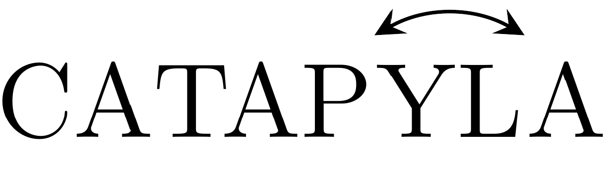

## Calculus, Statistics and Linear Algebra with Python 

Contains teaching material for lab sessions designed to introduce engineering
students to the Python libraries Matplotlib, NumPy and SymPy as a powerful set
of tools to tackle basic problems in Multivariable Calculus, Statistics and
Linear Algebra. The content is presented in the form of Jupyter notebooks.
Emphasis is placed on examples, exercises and the use of visualizations of
several types.